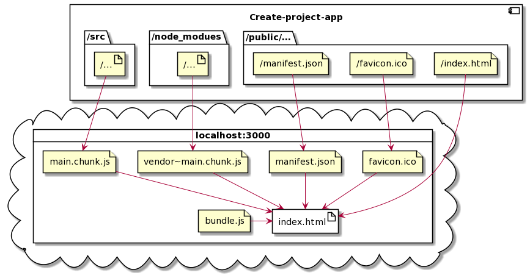

# JS_project2
Простой JS проект с readme.md

## Второй заголовок
...
###### Шестой заголовок

Одна простая строка
Текст на следующей строке

Первая строка<br/>
Вторая строка с разрывом строки

Третья строка с нового абзаца с *курсивом*, **жирным**, ***жирным курсивом***, ~~зачеркнутым~~ шрифтом.
>Цитата

---
Ссылка на [github](https://github.com/NikolasT1503/JS_project2)

Другой тип ссылки - [изучаем markdown][1]



---

```javascript
function someFunction() {
    return 2*2
}

somefunction()
```

```PlantUML
@startuml component
actor client
node app
database db

db -> app
app -> client
@enduml
```

#### Пример таблицы

# | attribute | description
--- | ---: | :---:
_1_ | Id | Идентификатор
2 | name | Название
3 | status | Статус


[1]: https://www.youtube.com/watch?v=FFBTGdEMrQ4